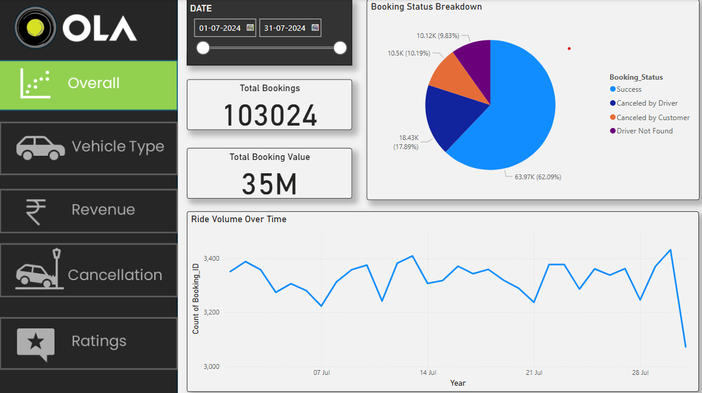

**OLA_Dashboard**

📌 **Project Overview**

This Power BI dashboard provides an analytical view of OLA ride bookings, cancellations, payments, and customer-driver interactions. The project focuses on key ride metrics, customer behavior, and performance insights to help stakeholders make data-driven decisions.

📊 **Features & Insights**

Ride Booking Trends: Track daily, weekly, and monthly ride patterns.

Booking Status Analysis: Understand successful, canceled, and incomplete rides.

Vehicle Type Distribution: Insights into the popularity of different vehicle categories (e.g., Bike, Mini, Sedan, SUV).

Location Insights: Analyze pickup and drop locations for high-demand areas.

Payment Trends: Study customer payment preferences (Cash, UPI, Credit Card, etc.).

Cancellation Analysis: Investigate reasons for ride cancellations by customers and drivers.

Customer & Driver Ratings: Evaluate service quality based on rating distributions.

Ride Distance & Value Analysis: Understand ride distances and booking values to optimize pricing strategies.

📂 **Dataset Description**

The dataset consists of 103,024 records with the following key columns:

Column Name:                Description

Date      :                 Ride booking date

Time        :               Ride booking time

Booking_ID   :              Unique ride identifier

Booking_Status :            Status (Success, Canceled by Customer/Driver, Incomplete)

Customer_ID   :             Unique customer identifier

Vehicle_Type   :            Type of vehicle booked (Bike, Mini, SUV, etc.)

Pickup_Location  :          Starting location of the ride

Drop_Location    :          Destination of the ride

V_TAT      :                Vehicle Turnaround Time (in minutes)

C_TAT        :              Customer Turnaround Time (in minutes)

Canceled_Rides_by_Customer: Reason for ride cancellations by customers

Canceled_Rides_by_Driver :  Reason for ride cancellations by drivers

Incomplete_Rides    :       Indicator for incomplete rides

Incomplete_Rides_Reason:    Reason for ride incompletion

Booking_Value    :          Total fare for the ride

Payment_Method   :          Mode of payment (Cash, UPI, Credit Card, etc.)

Ride_Distance     :         Distance traveled (in km)

Driver_Ratings      :       Rating given to the driver by customers

Customer_Rating    :        Rating given to the customer by drivers

🛠️ **Tools & Technologies Used**

Power BI - Data visualization and dashboard creation

Excel / CSV - Data preprocessing and analysis

SQL - Data querying and transformation (if applicable)

DAX (Data Analysis Expressions) - Custom calculations in Power BI

📌 **Key Findings**

Most Popular Vehicle Type: [To be filled based on analysis]

Peak Booking Hours: [To be filled based on analysis]

Major Cancellation Reasons: [To be filled based on analysis]

Customer & Driver Rating Trends: [To be filled based on analysis]

🚀 **How to Use**

Download the dataset and Power BI file (.pbix).

Open the Power BI file and refresh data sources if required.

Explore different reports, filters, and interactive visuals.

📢 **Future Enhancements**

Integrate live ride data for real-time analysis.

Add predictive analytics for ride demand forecasting.

Optimize pricing models based on ride patterns.

SNAPS

Overall Dashboard

